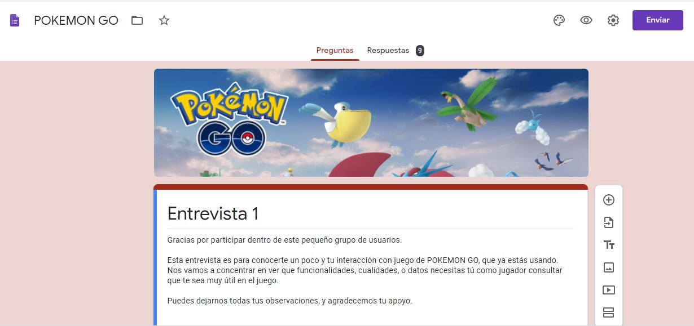
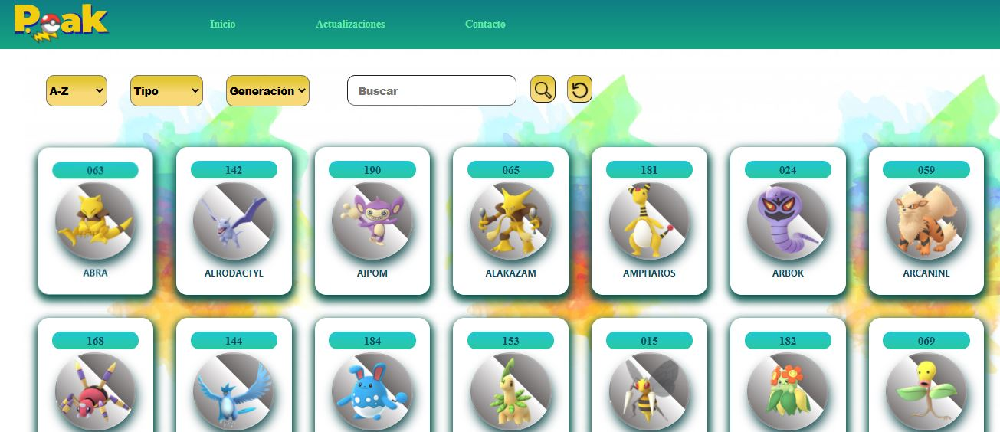
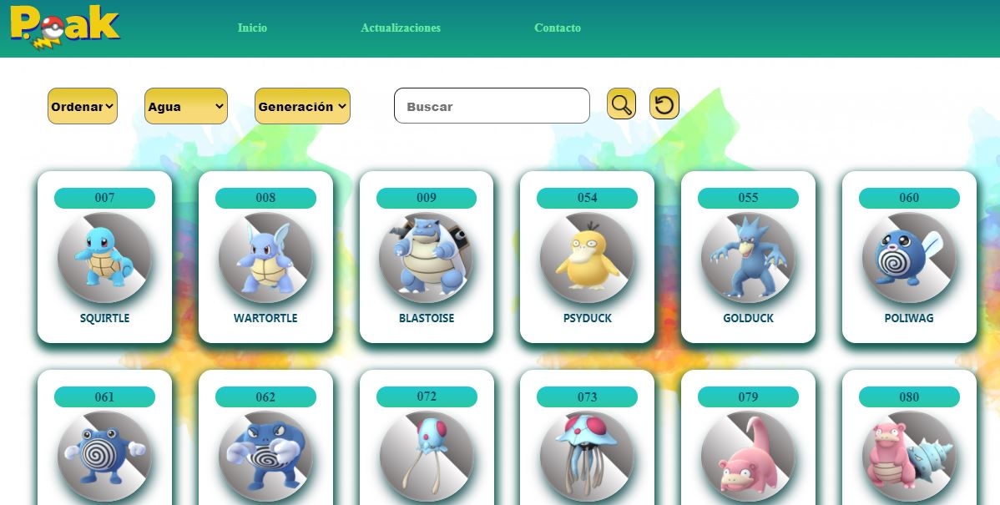
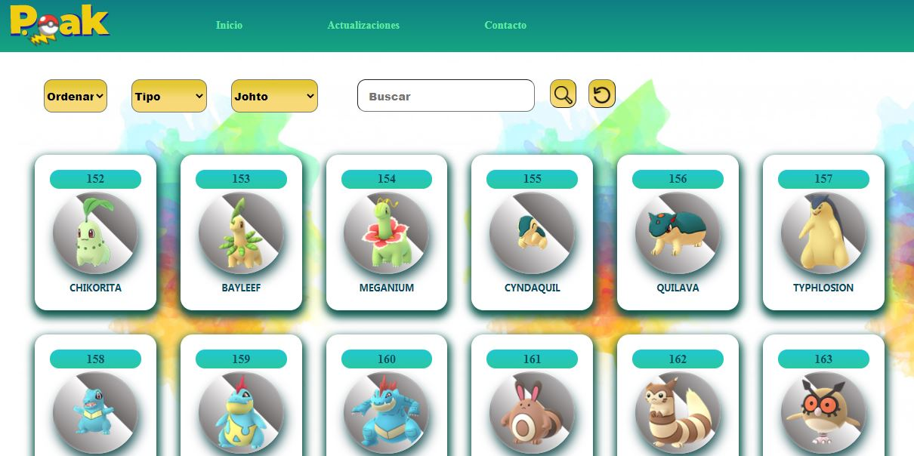
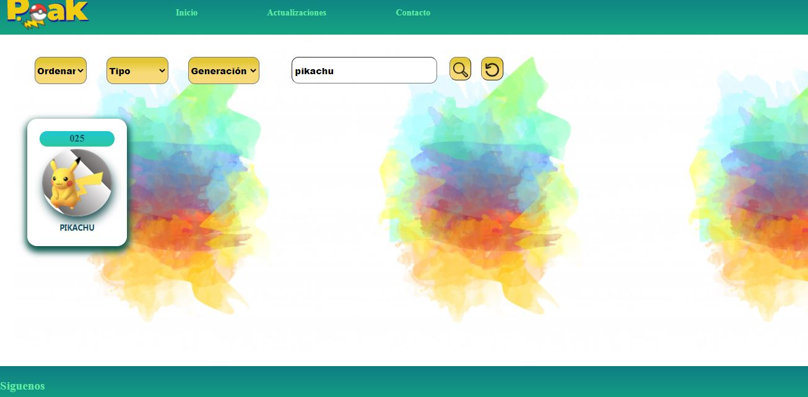

# P. Oak - Pokemon Go

# Índice

* [1. Definicion del proyecto](#1-Definicion-del-proyecto)

* [2. Objetivos del proyecto](#2-Objetivos-del-proyecto)

* [3. Usuario](#3-Usuario)

* [3.1. Historias de usuario](#31-Historias-de-usuario)

* [3.2. Diseño de la Interfaz de Usuario](#32-Diseño-de-la-Interfaz-de-Usuario)

* [3.2.1 Prototipo de baja fidelidad](#321-Prototipo-de-baja-fidelidad)

* [3.2.2. Prototipo de alta fidelidad](#322-Prototipo-de-alta-fidelidad)

* [3.2.3. Proyecto final](#323-Proyecto-final)

* [4. Testeos de usabilidad](#4-Testeos-de-usabilidad)

***

# 1. Definicion del proyecto

Es una página web en la que los Jugadores de Pokémon GO, podrán encontrar informacion importantes sobre los pokémons de la primera y segunda generación.

Podran realizar una consulta de su pokemon de interes, para obtener información sobre este, para realizar la consulta tendra diferentes maneras de ubicar el pokemon en consulta, por busqueda directa, por orden alfabetico, por tipo y generacion en la que este se encuentre. 

# 2. Objetivos del proyecto

Tenemos como objetivos:

- Dar información sobre los pokemos a los usuarios.
- Permitir conocer las fortalezas y debilidades de los pokemones, para saber cual usar en una batalla. 

# 3. Usuario

Nos enfocaremos en 2 tipos de usuarios:

- Usuario principiante: que esta empezando a jugar pokemon go y necesita familiarizarse con los pokemos que tiene disponibles.
- Usuario avanzado: Le proporcionaremos informacion importante, para que pueda elegir el pokemon que usará para la batalla y conquistar mas gimnasios. 

 
## 3.1. Historias de usuario.

Para poder indentificar nuestras historias de usuario hicimos encuentas. 

En la encuenta participaron 9 personas de las cuales:

- 7 son de nivel avanzado.
- 2 son de nivel principiante.

Con dichas encuestas se pudo sacar las historias de usuarios que se trabajarían en el proyecto.

### Historia 1: Pokemones ordenados alfabeticamante
* YO como jugador de Pokemon Go
* QUIERO tener los pokemones ordenados de la A-Z y de la Z-A
* PARA poder encontrarlo mas rapido.

### Historia 2: Pokemones filtrados por su tipo 
* YO como jugador de Pokemon Go
* QUIERO filtrar por tipos de pokemon.
* PARA saber que pokemon me servira para una batalla.

### Historia 3: Pokemones filtrados por su generacion
* YO como jugador de Pokemon Go
* QUIERO filtrar por su numero de pokedex.
* PARA poder encontrarlo mas rapido.

### Historia 4: Buscar por su nombre
* YO como jugador de Pokemon Go
* QUIERO buscar pokemones por su nombre.
* PARA poder encontrarlo mas rapido.

### Historia 5: Buscar por su nombre
* YO como jugador de Pokemon Go
* QUIERO buscar visualizar la información del pokemon de mi interes.
* PARA poder saber si lo uso en una batalla o no.

## 3.2. Diseño de la Interfaz de Usuario.

### 3.2.1. Prototipo de baja fidelidad.
#### Elaboración del LOGO

#### Primera Historia

#### Segunda Historia

#### Segunda Historia

### 3.2.2. Prototipo de alta fidelidad.
#### Primera Historia

#### Segunda Historia

#### Tercera Historia

#### Cuarta Historia

#### Quinta Historia

### 3.2.3. Proyecto Final.
#### Primera Historia

#### Segunda Historia

#### Tercera Historia

#### Cuarta Historia

# 4. Testeos de usabilidad

Para el testeo de usabilidad se hizo reuniones con nuestros usuarios.
En estas reuniones se le mostro las pantallas que componen la páginas y ellos deben indicarnos como navegarian en ellas, donde harian clic, donde ingresarian texto; de esta manera se pudo determinar que nuestra página es intuitiva y que el usuario entiende su funcionamiento de manera muy rápida y sencilla 

